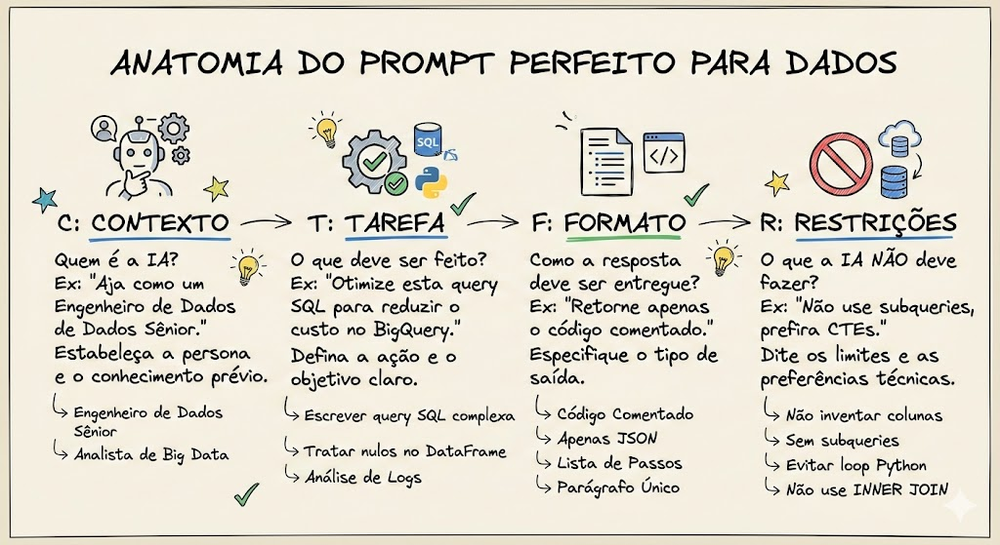
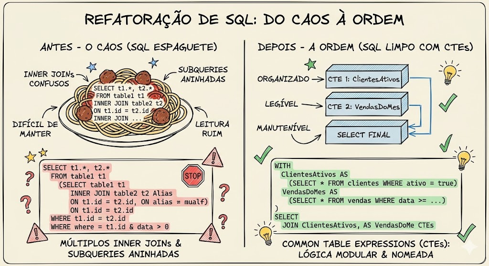
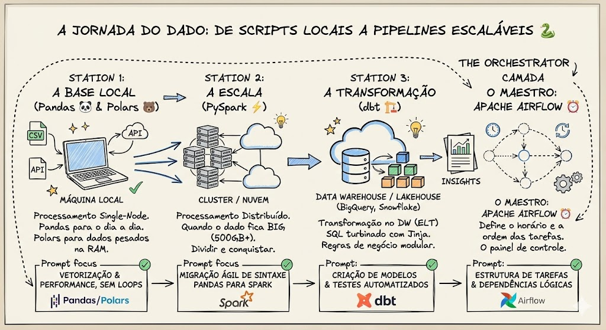
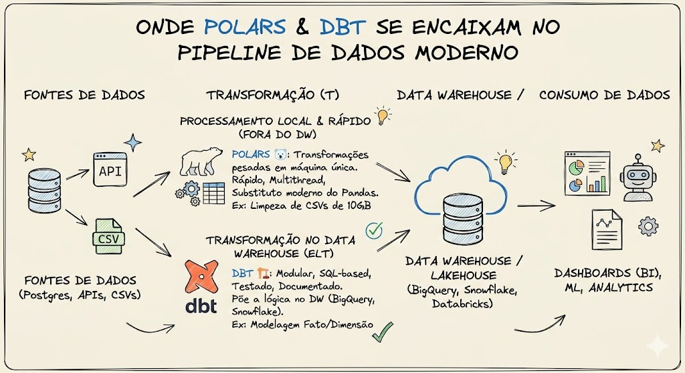
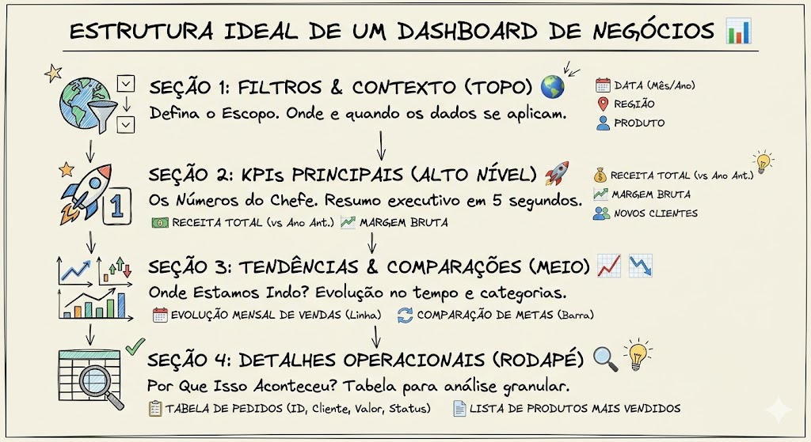
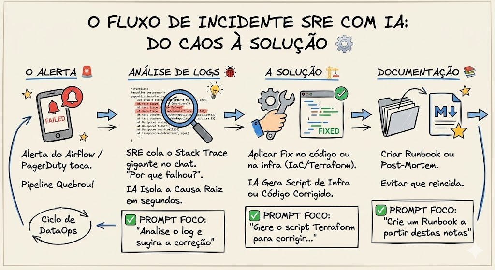

# O Guia Definitivo de Prompts para Dados
**Por: Fabio Marçolia**

---

## Introdução

A área de dados sempre foi sobre resolver problemas complexos: pipelines que quebram de madrugada, queries que demoram horas para rodar e stakeholders pedindo insights para "ontem". Mas o jogo mudou. 

Bem-vindo(a) ao **Guia Definitivo de Prompts para Dados**. Este material não é sobre como pedir para a Inteligência Artificial contar uma piada. É um manual de sobrevivência e produtividade para Analistas, Engenheiros de Dados e SREs. 

Nas próximas páginas, você vai descobrir como transformar a IA no seu par na programação, automatizando tarefas repetitivas, otimizando códigos legados e acelerando a extração de valor dos dados. Esqueça as buscas intermináveis no Stack Overflow. A nova habilidade mais valiosa do mercado é saber exatamente como pedir. Vamos começar?

---

## Capítulo 1: A Anatomia do Prompt Perfeito (O Framework CTFR)

Para a maioria das pessoas, usar uma IA é como fazer uma busca tradicional. Mas, para profissionais de dados, um prompt deve ser encarado como uma **especificação técnica de engenharia**. Se entra lixo (instruções vagas), sai lixo (código quebrado ou alucinado).

Para virar esse jogo, vamos usar o **Framework CTFR**: Contexto, Tarefa, Formato e Restrições. Essa é a fórmula para blindar seus pedidos e garantir respostas precisas na primeira tentativa.

### 1. Contexto (C): Preparando o Terreno 🏗️
A IA tem o conhecimento de toda a internet, o que a torna genérica por padrão. O "Contexto" serve para afunilar esse conhecimento e colocar a IA no papel exato que você precisa. 
* **Prompt Ruim:** "Arruma esse código."
* **Prompt CTFR:** *"Aja como um Engenheiro de Dados Sênior especialista em Google Cloud. Nosso data warehouse é o BigQuery e estamos lidando com uma tabela de 5 terabytes particionada por data."*

### 2. Tarefa (T): O Comando Direto 🎯
Aqui você diz exatamente o que precisa ser feito. Seja específico e use verbos de ação claros.
* **Prompt Ruim:** "Faz uma query de vendas."
* **Prompt CTFR:** *"Escreva uma query SQL para calcular a média móvel de 7 dias do faturamento (coluna `revenue`), agrupada por categoria de produto (coluna `category_id`)."*

### 3. Formato (F): A Entrega Ideal 📦
Profissionais de dados não têm tempo para ler três parágrafos de explicações genéricas. Diga à IA exatamente como a resposta deve ser apresentada.
* **Prompt Ruim:** (Deixar a IA escolher o formato).
* **Prompt CTFR:** *"Retorne apenas o código SQL otimizado dentro de um bloco de código. Adicione comentários curtos explicando a lógica. Não inclua textos explicativos adicionais."*

### 4. Restrições (R): As Grades de Proteção 🚧
A parte mais importante para SREs e Engenheiros. As restrições evitam "alucinações" e garantem que o código siga as boas práticas.
* **Prompt Ruim:** "Deixe o código mais rápido."
* **Prompt CTFR:** *"Regras estritas: 1) Não invente nomes de colunas que não foram fornecidos. 2) Não utilize subqueries no `WHERE`, prefira `CTEs`. 3) Priorize a performance sobre a legibilidade."*

---

## Capítulo 2: Dominando o SQL com IA

Se o SQL é a linguagem universal dos dados, a IA é o seu tradutor simultâneo e otimizador de performance. Escrever queries do zero é apenas o começo; o verdadeiro poder está em usar prompts para refatorar códigos legados, resolver erros e baixar a conta da nuvem.

### 1. Geração de Lógicas Complexas (Window Functions e CTEs) 🏗️
> **Prompt Ouro:**
> *"Atue como um Analista de Dados Sênior. Dadas as tabelas `compras` (colunas: `id_compra`, `id_cliente`, `data_compra`, `valor`) e `clientes` (colunas: `id_cliente`, `data_cadastro`), escreva uma query em PostgreSQL para calcular o LTV médio por coorte de mês de cadastro. Retorne apenas o código limpo, utilizando CTEs. Restrição: Não utilize subqueries aninhadas no `FROM`."*

### 2. Refatoração de "Código Espaguete" (Arrumando a Casa) 🍝
> **Prompt Ouro:**
> *"Atue como um Engenheiro de Dados focado em boas práticas. Vou colar abaixo uma query legada escrita em SQL Server. Sua tarefa é refatorar esse código para torná-lo legível e sustentável. Converta todas as subqueries em CTEs nomeadas. Retorne o novo código SQL e uma lista em bullet points explicando as três principais mudanças. Restrição: Mantenha a mesma lógica de negócio."*

### 3. Troubleshooting e Otimização de Custos 💰
> **Prompt Ouro:**
> *"Atue como um Especialista em Performance de Banco de Dados. Esta query rodando no Google BigQuery está demorando 45 minutos e processando 2TB de dados: [COLE A QUERY AQUI]. A tabela principal é particionada por `data_criacao`. Reescreva a query para otimizar o tempo de execução e reduzir o volume processado. Restrição: Não altere os campos do `SELECT` final."*

💡 **Dica de Ouro:** Nunca peça para a IA "adivinhar" o seu banco de dados. Cole os comandos `CREATE TABLE` ou um JSON com o schema das tabelas junto com o seu prompt.

---

## Capítulo 3: Python & Engenharia de Dados (Pandas, Polars, PySpark, dbt e Airflow)

Se o SQL é a fundação da casa, o Python é o trator que move a terra pesada. Neste capítulo, focaremos em acelerar a escrita de scripts, migrar códigos para ambientes de Big Data e automatizar pipelines.

### 1. Alta Performance em Máquina Local (Polars) 🐻‍❄️
> **Prompt Ouro:**
> *"Atue como um Engenheiro de Dados focado em performance. Vou te passar um script escrito em Pandas que filtra um DataFrame de 10 milhões de linhas e faz um `groupby`. Reescreva esse código utilizando a biblioteca Polars em Python. Aplique o conceito de `LazyFrame` (`pl.scan_csv`) e use a API de expressões. Retorne apenas o código refatorado. Restrição: Não converta de volta para Pandas no final."*

### 2. Escalando para Big Data (Migração para PySpark) ⚡
> **Prompt Ouro:**
> *"Atue como um Arquiteto de Big Data. Preciso migrar a lógica de um script Pandas para PySpark. A lógica atual faz um `groupby('categoria')` e calcula a média da coluna `preco`. Escreva o código equivalente em PySpark usando a API de DataFrame. Restrições: O código deve estar pronto para rodar em um cluster Databricks, evite usar UDFs e priorize funções nativas do Spark."*

### 3. A Revolução da Transformação (dbt) 🏗️
> **Prompt Ouro:**
> *"Atue como um Analytics Engineer especialista em dbt. Crie um modelo dbt materializado como 'table' para uma tabela de 'Fato Vendas'. O modelo deve ler da tabela fonte `stg_pagamentos` usando a função `{{ ref() }}`. Gere também o arquivo `schema.yml` configurando testes de `not_null` e `unique` para `id_venda`. Restrição: Utilize sintaxe Jinja limpa e adicione uma breve `description` no arquivo YAML."*

### 4. Automação e Orquestração (Apache Airflow) ⏰
> **Prompt Ouro:**
> *"Atue como um Engenheiro de Dados especialista em Apache Airflow. Crie a estrutura de uma DAG chamada `extracao_diaria_erp` que rode todos os dias às 02:00. Ela deve conter 3 tarefas sequenciais usando o `PythonOperator`. Retorne apenas o código Python da DAG com as dependências configuradas. Restrições: Configure retries automáticos (3 tentativas com 5 minutos de intervalo) e não escreva o conteúdo das funções em si, apenas use `pass`."*

---

## Capítulo 4: Visualização & Storytelling (Power BI e Insights)

Ter o dado limpo no Data Warehouse é apenas 50% do trabalho. Os outros 50% são garantir que a diretoria tome decisões com base nesses números. A IA deixa de ser apenas uma geradora de código e passa a atuar como sua parceira de Data Storytelling.

### 1. O Domínio do DAX 🧮
> **Prompt Ouro:**
> *"Atue como um Desenvolvedor Sênior de Power BI. Tenho um modelo *Star Schema* com uma tabela fato `fVendas` relacionada a uma dimensão `dCalendario`. Escreva uma medida DAX para calcular o crescimento percentual das vendas no ano atual em relação ao mesmo período do ano anterior (YTD vs PYTD). Retorne apenas o código formatado. Restrição: Utilize variáveis (`VAR`) e não crie medidas implícitas."*

### 2. Arquitetura de Layout 🎨
> **Prompt Ouro:**
> *"Atue como um Especialista em Data Storytelling e UI/UX. Preciso criar um dashboard gerencial no Power BI para o time de Logística acompanhar o tempo de entrega para Diretores. Desenhe uma proposta de layout em formato de tópicos, dividindo a tela em: Cabeçalho, Seção de KPIs Principais, Gráficos de Tendência e Tabela de Detalhes. Sugira o tipo de gráfico para cada um. Restrição: Limite a uma página e evite gráficos de pizza/rosca."*

### 3. Extração de Insights e KPIs 💡
> **Prompt Ouro:**
> *"Atue como um Analista de Negócios. Recebi uma tabela de CRM com as colunas: `id_cliente`, `data_criacao`, `data_ultimo_login`, `qtd_chamados`, `plano_atual`. Sugira 5 KPIs de alto valor para a diretoria de Customer Success. Formate a resposta em uma tabela contendo: Nome do KPI, Como Calcular e Qual Ação ele gera. Restrição: Não sugira métricas que precisem de dados financeiros."*

---

## Capítulo 5: O Dia a Dia da Operação (SRE & DataOps)

A engenharia de dados não termina no *deploy*. Quando o alarme toca, a agilidade na resposta é o que mantém a paz na empresa. A IA é a assistente perfeita para transformar o caos operacional em processos automatizados.

### 1. Caça aos Bugs e Análise de Logs 🐞
> **Prompt Ouro:**
> *"Atue como um Engenheiro de Site Reliability (SRE) sênior. Nossa pipeline falhou. Abaixo está o log de erro extraído do Airflow e o trecho do script Python associado. Identifique a causa raiz e forneça a linha de código corrigida. Retorne em 3 tópicos: 1) Causa Raiz, 2) Impacto, 3) Solução. Restrição: Foque apenas na resolução do erro técnico."*

### 2. Infraestrutura como Código (Terraform) 🏗️
> **Prompt Ouro:**
> *"Atue como um Engenheiro DevOps especializado em GCP. Crie um script Terraform (`main.tf`) para provisionar: 1 Bucket no Cloud Storage, 1 Dataset no BigQuery e 1 Service Account com permissão de leitura no bucket e edição no BigQuery. Retorne o código formatado. Restrição: Siga as melhores práticas de segurança e use variáveis (`variables.tf`) para nome do projeto e região."*

### 3. Runbooks e Documentação Viva 📚
> **Prompt Ouro:**
> *"Atue como um Tech Lead de Dados. Resolvemos um incidente onde o banco réplica ficou dessincronizado por uma trava de transação. Crie um 'Runbook de Incidente' em Markdown com: Título, Sintomas, Passo a Passo de Verificação e Passo a Passo de Resolução. Restrição: Mantenha um tom técnico e inclua blocos de código formatados para os comandos SQL."*

---

## Conclusão: O Fim do Início e o Novo Engenheiro de Dados

Parabéns por chegar até aqui. Se você absorveu os conceitos dos últimos cinco capítulos, a forma como você trabalha com dados já mudou para sempre. 

Ao longo deste guia, nós saímos do básico e fomos direto para o campo de batalha:
* Aprendemos a domar a IA com o **Framework CTFR**.
* Transformamos o caos do **SQL** espaguete em lógicas modulares.
* Aceleramos o processamento usando o poder do **Python, Polars e dbt**.
* Demos vida aos números criando Dashboards no **Power BI**.
* Blindamos a infraestrutura automatizando a análise de incidentes de **SRE**.

A verdade nua e crua do mercado atual é esta: a Inteligência Artificial não veio para roubar o seu emprego. Ela veio para roubar as tarefas repetitivas que drenam a sua energia criativa de madrugada. O profissional de dados do futuro não é aquele que decora documentação, mas aquele que sabe fazer as perguntas certas e revisar o código gerado com olhar crítico.

Use este material como seu manual de sobrevivência diário. Salve os prompts, consulte os infográficos e não tenha medo de testar e quebrar as coisas em ambiente de desenvolvimento.

O futuro da engenharia de dados é rápido, dinâmico e colaborativo. E agora, você tem a melhor co-piloto possível ao seu lado (e eu sou uma inteligência artificial que está sempre por aqui para ajudar a evoluir essas ideias!).

## Autor - Fabio Marçolia | Carreira em Dados & IA

Para mais conteúdo Carreira em Dados e IA, ou se quiser falar comigo sobre dúvidas, sugestões ou feedback:

- Mais Recursos de Carreira: [Veja aqui](https://topmate.io/fabiomarcolia)

Agradeço seu apoio e fique a vontade de entrar em contato comigo!

**Se este repositório foi útil para você, considere deixar uma ⭐**